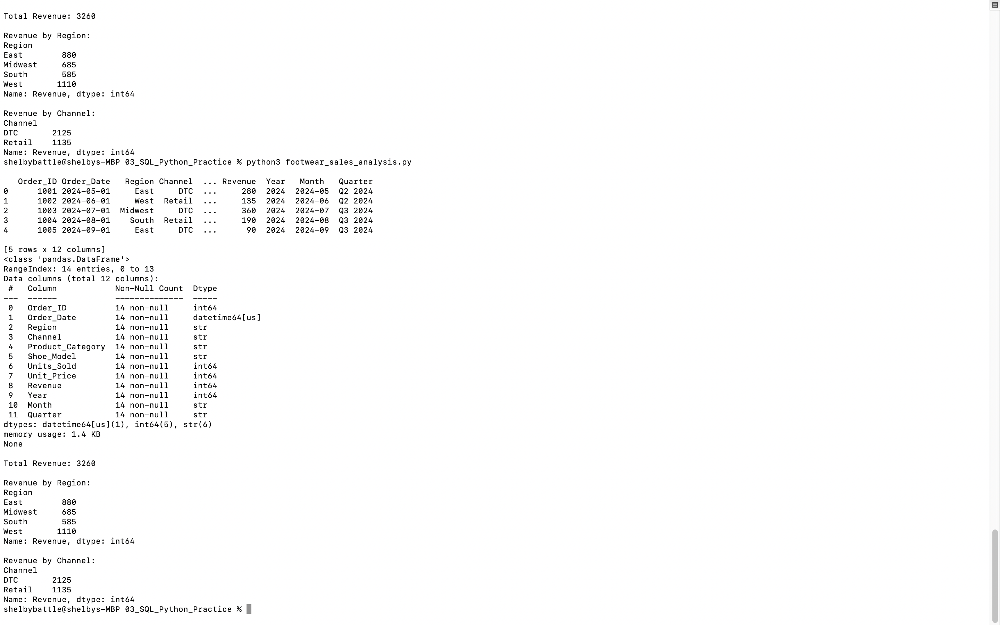

# End-to-End Sales Performance Analysis (SQL + Python)

## Project Overview
This project extends a footwear sales analysis into Python using pandas to automate KPI calculations and performance reporting. The script evaluates regional and channel revenue distribution to identify top-performing segments and support data-driven decisions.
---

## Tools Used
- Python
- pandas
- SQL-style aggregation
- Excel (data source)
- Git / GitHub

---

## Key Metrics Calculated

- Total Revenue: $3,260
- Revenue by Region:
  - West: 1,110
  - East: 880
  - Midwest: 685
  - South: 585
- Revenue by Channel:
  - Direct-to-Consumer (DTC): 2,125
  - Retail: 1,135

---

## Business Insights

- The West region generated the highest revenue ($1,110).
- Direct-to-Consumer (DTC) channel significantly outperformed Retail.
- Total revenue for the period analyzed was $3,260.
- Regional distribution suggests stronger performance in West and East markets.

---

## What This Demonstrates

- Reading Excel files with pandas
- Selecting specific sheets
- Data inspection using `.head()` and `.info()`
- Groupby aggregation
- Business KPI calculation
- Automating reporting logic

---

## How to Run

From the project root:

```bash
cd 03_SQL_Python_Practice
python3 footwear_sales_analysis.py
```

---

## Output Preview

Below is the terminal output after running the Python analysis script:


---

## Key Insights

- Direct-to-Consumer (DTC) channel generated the highest revenue.
- The West region generated the highest revenue ($1,110), indicating stronger regional performance.
- Total revenue for the analyzed period was $3,260.
- Automated aggregation reduced manual Excel processing.
